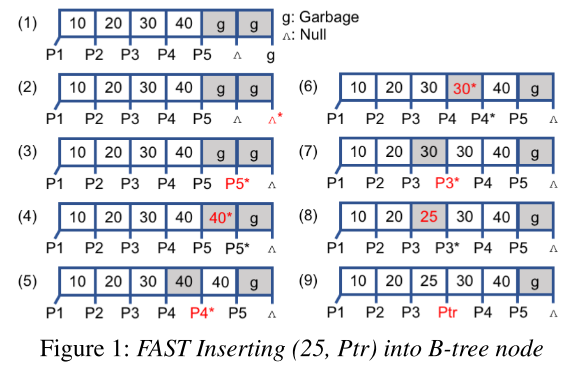
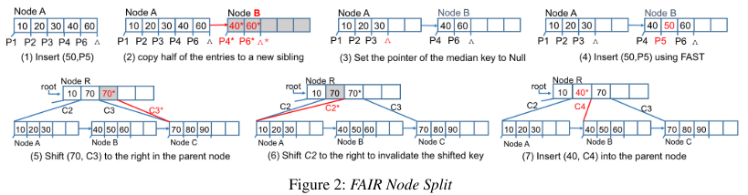

## Introduction

* Introduction to PM: MRAM, STT-RAM, 3D Xpoint ...
* B+ tree 
  * High degree of node fan-out, a balanced tree height, dynamic resezing
  * Cache-conscious variants of B+-tree (CSB-tree, FAST)
* PM raises new challenges in using B+-tree
  * Legacy is based on that block I/O is failure atomic
  * Atomicity in memory operation: 64 bits (8 Bytes), Data transfer: cache line size: 64 Bytes
    * 이전에는 memory가 volatile이어서 문제없었음.
    * 현대 프로세서는 memory operation 순서를 바꿔서 실행함. (out of order)
    * B+-tree를 PM에서 쓰면 consistency를 보장하기 위해 명시적으로 cache line flush와 memory fence 를 호출.
* Related work 소개: NV-tree, FP-tree, wB-tree
  * Challenges
    * 많은 cache flush
      * 해결책: append-only 방식으로 트리 노드 업데이트, 추가의 메타데이터 ==> 키에 대한 간접 액세스를 위한 추가 메타 데이터 및 정렬되지 않은 항목은 캐시 로컬리티에 영향을 미치고 액세스된 캐시 라인 수를 증가시켜 검색 성능을 저하시킬 수 있다.
    *  Tree rebalancing을 위한 logging을 필요로 하는것
      * NV-tree, FP-tree: Leaf 노드만 PM에 놓고, 중간 노드는 DRAM에
        * Logging을 안하지만 시스템 fail 시에 tree를 재구성해야하고 즉시 복구가 불가능한 단점이 있음.
* **FAST(Failure Atomic Shift)&FAIR(Failure Atomic In-place Rebalance):** 
  * Tolerate transient inconsistency: partially updated inconsistent tree status
  * Read transaction은 불완전한 이전 트랜잭션 상태를 감지할 수 있고 inconsistency 상황을 쿼리의 correctness를 잃지 않고 무시할 수 있다. 
  * **B +-tree 노드의 모든 포인터가 고유한 경우 중복 포인터가 있으면 시스템이 충돌시 트랜잭션 상태를 식별하고 로깅없이 B +-tree를 일관된 상태(consistent state)로 복구 할 수 있다.**
  * Read transaction은 non-blocking: 모든 store instruction이 B +-tree 인덱스의 정확한 검색 결과를 보장하는 다른 상태로 변환하면 read transcation은 concurrent write transaction이 B +-tree 노드 변경을 마칠 때까지 기다릴 필요가 없다.
  * 개별 작업을 올바르게 보장함으로써 일관성을 보장하고 불일치는 읽기 작업에 의해 처리된다.

## B+-tree for Persistent Memory

### Challenge: clflush and mfence

* 일반적인 transaction consistecy 보장 기법: CoW(copy-on-write: out-of-place manner)
  *  Block-based 구조에서는 수정 안된 부분까지 block 전체를 다시 write 해서 비싸다.
* B+-tree 에서 노드에 in-place update를 위해 key 포인터가 순서대로 정렬되어있다.
* PM에서 Shift operation을 수행할 때 consistency와 out-of-order execution을  보장하기 위해 각각 clflush와 mfence를 부른다.
  * Append-only update 기법은 추가 메타 데이터 나 트리 노드의 정렬되지 않은 키를 모두 읽어야하므로 쓰기 성능 향상이 읽기 오버 헤드와 동반된다. *(이 내용은 잘 모르겠다...)*

### Reordering Memory Accesses

* CPU 성능 > 메모리 성능 ==> Memory write reordering은 memory bandwidth에 좋다.
  * 메모리는 여러 뱅크로 구성되는데 reordering을 하면 cache line이 병렬적으로 메모리에 내려간다.
* CPU: Total store ordering은 보장, but 명령간에 의존성이 없으면 reorder stores-after-loads, loads-after-stores, loads-after-loads
* 본 논문: 1) strict persistency model ==>  2) relaxed persistency model
  * Memory persistent model은 relaxed persistency model에서 persist order를 volatile로 부터 벗어나게 할 수 있게한다.*(완벽히 와닿지 않는다..!!!)*

## Failure-Atomic ShifT(FAST)

### Shift and Memory Ordering

* load와 store의 종속성이 있으면 reordering을 하지 않는다.
* **FAST는 명시적으로 memory fence와 cache line flush를 부르지 않고 shift 오퍼레이션을 수행할 수 있다.**
* Sorted array에서 값을 insert할 때 가장 오른쪽 값부터(reverse order) 방문한다.
* The dependency between the consecutive move operations, **e[i+1] ←e[i] and e[i] ← e[i −1], prohibits the CPU from performing Out-Of-Order writes**
* guarantees that the records are moved while satisfying the prefix constraint, i.e., **if e[i] ← e[i−1] is successful, all preceding moves, e[ j] ← e[ j −1], j = i+1, . . . ,N have been successful.**
* Array 크기가 여러 캐시 라인에 걸쳐있는 경우, clflush를 명시 적으로 호출하지 않으면 어떤 캐시 라인이 먼저 flush되는지 확실하지 않다.
* FAST 알고리즘은 우리가 array element를 하나의 캐시 라인에서 인접한 캐시 라인으로 이동할 때 , 캐시 라인 flush 명령을 호출한다. ==> 캐시 라인 경계를 넘을 때만 캐시 라인 flush를 호출하므로 B +-tree 노드의 더티 캐시 라인 수만큼 캐시 라인 flush 명령을 호출한다.
* 캐시라인을 flush하지 않고 PM으로 eviction 되는 것은 상관 없다. FAST는 오직 dirty 캐시라인만 순서대로 flush 한다.
* 캐시라인을 넘어갈 때 load,store는 종속성이 있으므로 reorder 되지 않아 memory fence를 할 필요 없지만 cacheline flush 간에는 reorder 될 수 있으므로 memory fence를 해야한다.

### Endurable Inconsistency during Shift

* B+-tree nodes do not allow duplicate pointers
  * 탐색 동안 발견 된 중복 포인터 사이의 키는 트랜잭션에 의해 무시 될 수 있으며 허용 가능한 일시적인 불일치 상태로 간주된다.
* 정렬 된 배열에서 키를 찾은 후 왼쪽 및 오른쪽 자식 포인터의 주소가 동일한지 확인한다.
  * 동일하면, 트랜잭션은 키를 무시하고 다음 키를 계속 읽습니다.**(아직 shifting 중)**
  *  수정된 traversal 알고리즘은 각 트리 노드 방문당 하나 이상의 비교 명령만 필요하므로 트랜잭션에 무시할 수있는 오버 헤드가 발생한다.

### Insertion with FAST for TSO

* 
* B+-tree에서는 key, pointer(key, value)를 함께 저장하고 항상 함께 flush된다.
* 먼저 (2)와 같이 sentinal 포인터 Null을 오른쪽으로 이동한다. 다음으로, 마지막 키 40의 오른쪽 자식 포인터 P5를 오른쪽으로 이동 한 다음 (3)과 (4)에 표시된 것처럼 키 40을 오른쪽으로 이동한다. (3) 및 (4)에서, 우리는 각각 마지막 키로서 가비지 키 및 복제 키 (40)를 갖는다. **이러한 불일치는 다른 트랜잭션이 동일한 포인터 사이의 키를 무시하도록 허용함으로써 허용 될 수 있다**. (P5 및 P5 *).
* (5)에서, P5를 덮어 써서 P4를 이동시킨다. 이 atomic write은 이전 키 40  ([P4,40, P4 *])을 무효화하고 시프트 된 키 40 ([P4 *, 40, P5 *])의 유효성을 검사합니다. **이 시점에서 시스템이 충돌하더라도 중복 포인터 ([P4,40, P4 *]) 사이의 키 40은 무시된다.** (왼쪽 오른쪽 포인터 주소가 같기 때문...)
* 다음으로, (6)에서 키 (40)를 덮어 써서 키 (30)를 오른쪽으로 이동시킬 수 있다. 다음으로 (7)에서 P3을 오른쪽으로 이동하여 **이전 키 30 ([P3,30, P3 *])을 무효화하고** 삽입하는 키 25를위한 공간을 만든다.
* 단계 (8)에서, 세 번째 슬롯에 25를 저장한다. 그러나 키 25는 동일한 포인터 사이에 있기 때문에 유효하지 않다([P3,25, P3 *]). 
* **마지막으로, 단계 (9)에서, 새로운 키 (25)를 검증 할 새로운 포인터 Ptr로 P3 *를 덮어 쓰게된다. FAST에서, 새로운 포인터를 작성하는 것은 삽입의 commit 마크가 된다.**
* 포인터와 달리 키 크기는 다를 수 있다. ==> 키 크기가 8 바이트보다 크면 원자 적으로 쓸 수 없다.
  * 그러나 FAST insertion은 키가 동일한 포인터 사이에있는 경우에만 키를 변경한다. 따라서 키 크기가 8 바이트보다 크고 atomic하게 업데이트 할 수 없더라도 read operation은 이러한 부분적으로 작성된 키를 무시하고 정확한 검색 결과를 보장한다. *(키가 8 Byte를 초과해도 된다는 이야기? 왜냐면 동일한 pointer 사이에 key 가 있을때만 key를 변경하니까?)*
  * FAST insertion 알고리즘의 모든 single 8 Bytes 쓰기 작업은 부분적으로 삭제된 트리 노드를 항상 사용할 수 있기 때문에 failure-atomic이고 충돌에 일관성이 있다. 따라서 업데이트 중에 시스템이 중단 되더라도 FAST는 더티 캐시 라인을 순서대로 flush하는 한 복구 가능성을 보장한다.

### FAST for Non-TSO Architecture 

* ARM 프로세서는 종속성이없는 경우 스토어 명령어를 재정렬 할 수 있다. 즉, store 명령이 키를 업데이트하고 다른 store 명령이 포인터를 업데이트하면 순서를 다시 정할 수 있다.
* 1) 키가 8 바이트보다 크지 않은 경우: 어느 배열의 키나 포인터도 부분적으로 업데이트 된 상태가 아니므로 키와 포인터를 독립적으로 이동할 수 있다. i 번째와 i + 1 번째 키가 같고 j 번째와 j + 1 번째 포인터가 같다고 가정합니다 (i is not equal to j). 두 배열에서 중복 요소 중 하나를 무시하고 키의 자식 노드에 대한 포인터를 쉽게 정렬하고 B + 트리 노드의 올바른 논리적 뷰를 재구성 할 수 있다.
* 2)  키가 8 바이트보다 큰 경우: 
  * shift 마다 memory fence ==> 캐시라인 flush는 적다.
  * 큰 키는 분리된 heap에 저장하고 노드에서 pointer로 가리킨다
    * memory fence는 안부르지만 indirect access and poor cache locality가 성능을 감소시킨다.

### Deletion with FAST

* Deletion can be performed in a similar manner but in reverse order of insertion.
  * Insertion 그림을 반대로 수행하면 된다...

## Failure-Atomic In-place Rebalancing

### FAIR: Node Split

* 디스크 기반 B- 트리와 PM에 대한 최근 제안 된 B +-트리 변형에서 여러 트리 노드를 분할하거나 병합 할 때 로깅 또는 저널링이 사용되었다. 
  * 트리 노드가 분할되면 (1) sibling 노드를 만들고 (2) 전체 노드에서 새로운 sibling 노드로 항목의 절반을 이동하고 (3) 부모 노드에 새로운 sbling 노드에 대한 포인터를 삽입하고 .
  * 이 세 단계는 atmoic하게 수행해야하므로 로깅을 사용해야 한다. 그러나 로깅은 더티 페이지를 복제한다. 쓰기 트래픽을 증가시킬뿐만 아니라 트리 노드에 대한 동시 액세스도 차단한다.
* Algorithm 2에 설명 된 FAST in-place update와 FAIR 노드 분할 알고리즘을 활용하여 비싼 로깅을 피할 수 있다. B-link tree [25]에서와 같이 리프 노드뿐만 아니라 내부 노드를 위한 sibling 노드 포인터를 저장한다.

* 먼저 (1)과 같이 트리에 노드가 하나만 있다고 가정. 
  * 새 키 50을 삽입하면 리프 노드 A가 분할된다. (2)에서 PM heap manager를 사용하여 sibling 노드 B를 작성하고, 노드에 있는 element 절반을 복사하고, 새 노드에 대한 캐시 라인 플러시를 호출하고, 노드 A의 sibling 포인터가 sibling 노드 B를 가리 키도록합니다. Overfull 된 노드 A에서 마이그레이션 된 항목을 삭제하기 전에 sbling pointer가 노드 A 써져야한다. 
  * 노드 A와 B에 중복 된 항목이 있기 때문에 트리 노드의 일관성이 위반 된 것처럼 보인다. **그러나 오른쪽 sibling B 노드 (40)의 가장 작은 키가 ovrerfull 노드 A (60)의 가장 큰 키보다 작기 때문에 A에서 중복 항목을 삭제할 때까지 오른쪽 형제 노드 B는 사용되지 않는다.**
* 시스템이 상태 (2)에서 충돌한다면 ==> 이 중복성과 불일치를 허용하는 기본 가정은 오른쪽 형제 노드가 항상 왼쪽 형제 노드보다 큰 키를 가지고 있다는 것이다.

### FAIR: Node Merge

* 삭제로 인해 노드가 충분히 활용되지 않는 경우 사용되지 않는 노드와 왼쪽 형제 노드가 사실상 단일 노드가되도록 부모 노드에서 활용도가 낮은 노드를 삭제합니다. 사용률이 낮은 노드를 부모 노드에서 분리하면 사용률이 낮은 노드와 왼쪽 형제 노드를 병합 할 수 있는지 확인합니다. 
* 왼쪽 형제 노드에 충분한 항목이 있으면 FAST를 사용하여 일부 항목을 왼쪽 형제 노드에서 활용도가 낮은 노드로 이동하고 오른쪽 형제 노드의 가장 작은 새 키를 부모 노드에 삽입합니다. 이 노드 병합 알고리즘은 분할 알고리즘과 유사하지만 분할 알고리즘의 역순으로 수행됩니다. 따라서 노드 병합 알고리즘의 실제 예는 그림 2에 표시된 단계의 순서를 반대로하여 설명 할 수 있습니다.

## Lock-Free Search

* ;

### Lock-Free Search Consistency Model

* ;

### Lazy Recovery for Lock-Free Search

* ;

[jekyll-docs]: https://jekyllrb.com/docs/home
[jekyll-gh]:   https://github.com/jekyll/jekyll
[jekyll-talk]: https://talk.jekyllrb.com/